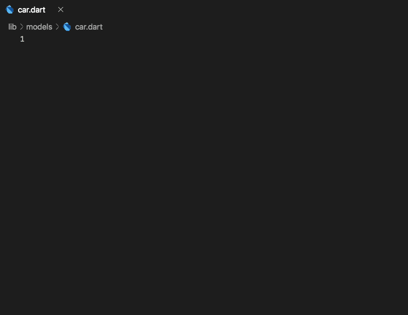

# Snippets for VSCode

Thanks to [@peekpt](https://github.com/peekpt), there are now snippets for building model classes for Hive. They allow you to write `HiveObjects` in record time:



## Installation

It is very easy to add Hive snippets to VSCode:

1. Call your commands prompt Cmd+Shift+P and type "user snipp"
2. Select Configure User Snippets and choose dart.json
3. Paste the code below and save it.

## Usage

* Create a dart file `example.dart`
* Enter one of the commands below
* With `tab` you can navigate the input positions

| Command | Action |
| :--- | :--- |
| `hive` | Creates the basic structure of a Hive model and extends `HiveObject`. |
| `hivec` | Creates the basic structure of a Hive model. |
| `hf` | Creates a `HiveField()` annotation. |
| `ht` | Creates a `HiveType()` annotation. |
| `hfs` | Creates a String Hive field. |
| `hfi` | Creates an int Hive field. |
| `hfb` | Creates a bool Hive field. |
| `hfl` | Creates a List Hive field. |
| `hfd` | Creates a double Hive field. |

```javascript
{
  "HiveType class extends HiveObject": {
    "prefix": "hive",
    "body": [
      "import 'package:hive/hive.dart';",
      "",
      "part '${TM_FILENAME_BASE}.g.part';",
      "",
      "@HiveType()",
      "class ${TM_FILENAME_BASE/(.*)/${1:/pascalcase}/} extends HiveObject {",
      "\t@HiveField(0)",
      "\tString id;",
      "\t${0:// Hive fields go here}",
      "}"
    ],
    "description": "Creates an HiveType class extending HiveObject structure based on the filename."
  },
  "HiveType class": {
    "prefix": "hivc",
    "body": [
      "import 'package:hive/hive.dart';",
      "",
      "part '${TM_FILENAME_BASE}.g.part';",
      "",
      "@HiveType()",
      "class ${TM_FILENAME_BASE/(.*)/${1:/pascalcase}/} {",
      "\t@HiveField(0)",
      "\tString id;",
      "\t${0:// Hive fields go here}",
      "}"
    ],
    "description": "Creates an HiveType class structure based on the filename."
  },
  "@HiveField(#)": {
    "prefix": "hf",
    "body": [
      "@HiveField(${1})",
      "${2};",
      "${0}"
    ],
    "description": "Creates @HiveField({number})"
  },
  "@HiveType()": {
    "prefix": "ht",
    "body": [
      "@HiveType()",
      "${0}"
    ],
    "description": "Creates @HiveType()"
  },
  "@HiveField(#) String": {
    "prefix": "hfs",
    "body": [
      "@HiveField(${1})",
      "String ${2};",
      "${0}"
    ],
    "description": "Creates @HiveField({number}) String"
  },
  "@HiveField(#) int": {
    "prefix": "hfi",
    "body": [
      "@HiveField(${1})",
      "int ${2};",
      "${0}"
    ],
    "description": "Creates @HiveField({number}) int"
  },
  "@HiveField(#) bool": {
    "prefix": "hfb",
    "body": [
      "@HiveField(${1})",
      "bool ${2};",
      "${0}"
    ],
    "description": "Creates @HiveField({number}) bool"
  },
  "@HiveField(#) List": {
    "prefix": "hfl",
    "body": [
      "@HiveField(${1})",
      "List<${2}> ${3};",
      "${0}"
    ],
    "description": "Creates @HiveField({number}) List<>"
  },
  "@HiveField(#) double": {
    "prefix": "hfd",
    "body": [
      "@HiveField(${1})",
      "double ${2};",
      "${0}"
    ],
    "description": "Creates @HiveField({number}) double"
  }
}
```

